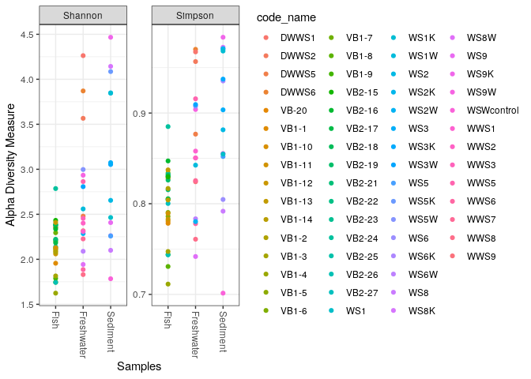
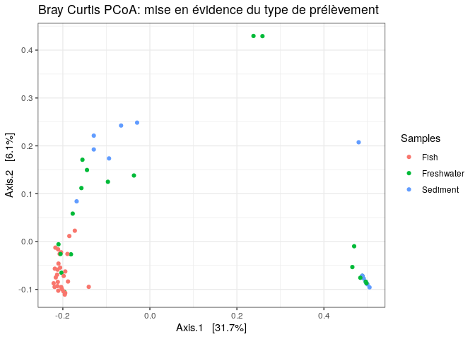
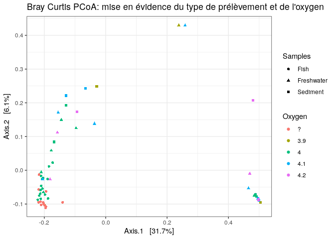
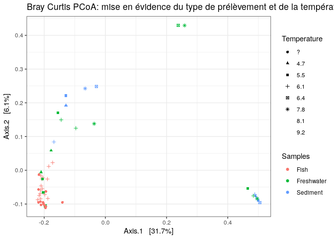
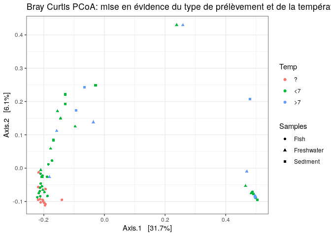
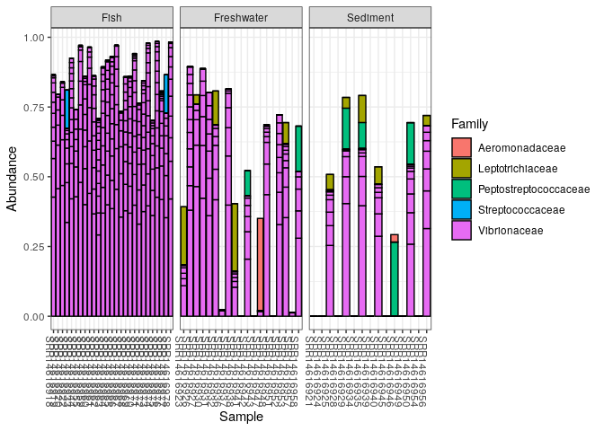
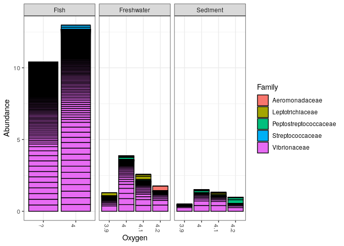
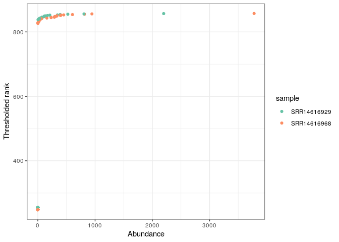

CC3
================
Mrozinski Alexandre

``` r
knitr::opts_chunk$set(echo=TRUE, eval=TRUE)
```

### Lien de l’article: <https://www.nature.com/articles/s41598-021-97980-3>

``` bash
mkdir data
wget -P data -i URLs
```

``` bash
cd data
gunzip -d *.gz
```

``` r
path <- "data"
list.files(path)
```

    ##   [1] "filtered"            "SRR14616918_1.fastq" "SRR14616918_2.fastq"
    ##   [4] "SRR14616919_1.fastq" "SRR14616919_2.fastq" "SRR14616920_1.fastq"
    ##   [7] "SRR14616920_2.fastq" "SRR14616921_1.fastq" "SRR14616921_2.fastq"
    ##  [10] "SRR14616922_1.fastq" "SRR14616922_2.fastq" "SRR14616923_1.fastq"
    ##  [13] "SRR14616923_2.fastq" "SRR14616924_1.fastq" "SRR14616924_2.fastq"
    ##  [16] "SRR14616925_1.fastq" "SRR14616925_2.fastq" "SRR14616926_1.fastq"
    ##  [19] "SRR14616926_2.fastq" "SRR14616927_1.fastq" "SRR14616927_2.fastq"
    ##  [22] "SRR14616928_1.fastq" "SRR14616928_2.fastq" "SRR14616929_1.fastq"
    ##  [25] "SRR14616929_2.fastq" "SRR14616930_1.fastq" "SRR14616930_2.fastq"
    ##  [28] "SRR14616931_1.fastq" "SRR14616931_2.fastq" "SRR14616932_1.fastq"
    ##  [31] "SRR14616932_2.fastq" "SRR14616933_1.fastq" "SRR14616933_2.fastq"
    ##  [34] "SRR14616934_1.fastq" "SRR14616934_2.fastq" "SRR14616935_1.fastq"
    ##  [37] "SRR14616935_2.fastq" "SRR14616936_1.fastq" "SRR14616936_2.fastq"
    ##  [40] "SRR14616937_1.fastq" "SRR14616937_2.fastq" "SRR14616938_1.fastq"
    ##  [43] "SRR14616938_2.fastq" "SRR14616939_1.fastq" "SRR14616939_2.fastq"
    ##  [46] "SRR14616940_1.fastq" "SRR14616940_2.fastq" "SRR14616941_1.fastq"
    ##  [49] "SRR14616941_2.fastq" "SRR14616942_1.fastq" "SRR14616942_2.fastq"
    ##  [52] "SRR14616943_1.fastq" "SRR14616943_2.fastq" "SRR14616944_1.fastq"
    ##  [55] "SRR14616944_2.fastq" "SRR14616945_1.fastq" "SRR14616945_2.fastq"
    ##  [58] "SRR14616946_1.fastq" "SRR14616946_2.fastq" "SRR14616947_1.fastq"
    ##  [61] "SRR14616947_2.fastq" "SRR14616948_1.fastq" "SRR14616948_2.fastq"
    ##  [64] "SRR14616949_1.fastq" "SRR14616949_2.fastq" "SRR14616950_1.fastq"
    ##  [67] "SRR14616950_2.fastq" "SRR14616951_1.fastq" "SRR14616951_2.fastq"
    ##  [70] "SRR14616952_1.fastq" "SRR14616952_2.fastq" "SRR14616953_1.fastq"
    ##  [73] "SRR14616953_2.fastq" "SRR14616954_1.fastq" "SRR14616954_2.fastq"
    ##  [76] "SRR14616955_1.fastq" "SRR14616955_2.fastq" "SRR14616956_1.fastq"
    ##  [79] "SRR14616956_2.fastq" "SRR14616957_1.fastq" "SRR14616957_2.fastq"
    ##  [82] "SRR14616958_1.fastq" "SRR14616958_2.fastq" "SRR14616959_1.fastq"
    ##  [85] "SRR14616959_2.fastq" "SRR14616960_1.fastq" "SRR14616960_2.fastq"
    ##  [88] "SRR14616961_1.fastq" "SRR14616961_2.fastq" "SRR14616962_1.fastq"
    ##  [91] "SRR14616962_2.fastq" "SRR14616963_1.fastq" "SRR14616963_2.fastq"
    ##  [94] "SRR14616964_1.fastq" "SRR14616964_2.fastq" "SRR14616965_1.fastq"
    ##  [97] "SRR14616965_2.fastq" "SRR14616966_1.fastq" "SRR14616966_2.fastq"
    ## [100] "SRR14616967_1.fastq" "SRR14616967_2.fastq" "SRR14616968_1.fastq"
    ## [103] "SRR14616968_2.fastq" "SRR14616969_1.fastq" "SRR14616969_2.fastq"
    ## [106] "SRR14616970_1.fastq" "SRR14616970_2.fastq" "SRR14616971_1.fastq"
    ## [109] "SRR14616971_2.fastq" "SRR14616972_1.fastq" "SRR14616972_2.fastq"
    ## [112] "SRR14616973_1.fastq" "SRR14616973_2.fastq" "SRR14616974_1.fastq"
    ## [115] "SRR14616974_2.fastq" "SRR14616975_1.fastq" "SRR14616975_2.fastq"
    ## [118] "SRR14616976_1.fastq" "SRR14616976_2.fastq" "SRR14616977_1.fastq"
    ## [121] "SRR14616977_2.fastq" "SRR14616978_1.fastq" "SRR14616978_2.fastq"

``` r
fnFs <- sort(list.files(path, pattern="_1", full.names = TRUE))
fnRs <- sort(list.files(path, pattern="_2", full.names = TRUE))
sample.names <- sapply(strsplit(basename(fnFs), "_"), `[`, 1)
```

``` r
plotQualityProfile(fnRs[1:2])
```

    ## Warning: The `<scale>` argument of `guides()` cannot be `FALSE`. Use "none" instead as
    ## of ggplot2 3.3.4.
    ## ℹ The deprecated feature was likely used in the dada2 package.
    ##   Please report the issue at <]8;;https://github.com/benjjneb/dada2/issueshttps://github.com/benjjneb/dada2/issues]8;;>.

<!-- -->

``` r
plotQualityProfile(fnFs[1:2])
```

<!-- -->

# Filter and trim

``` r
filtFs <- file.path(path, "filtered", paste0(sample.names, "_F_filt.fastq.gz"))
filtRs <- file.path(path, "filtered", paste0(sample.names, "_R_filt.fastq.gz"))
names(filtFs) <- sample.names
names(filtRs) <- sample.names
```

``` r
out <- filterAndTrim(fnFs, filtFs, fnRs, filtRs, trimLeft=c(50,55), truncLen =c(145,130),
              maxN=0, maxEE=c(2,2), truncQ=2, rm.phix=TRUE,
              compress=TRUE, multithread=TRUE)
head(out)
```

    ##                     reads.in reads.out
    ## SRR14616918_1.fastq    20645      9148
    ## SRR14616919_1.fastq    19884      9129
    ## SRR14616920_1.fastq    11289      5173
    ## SRR14616921_1.fastq     6970      2173
    ## SRR14616922_1.fastq    22738      9437
    ## SRR14616923_1.fastq    21141      4777

#### Amorces de 50 et 55 pb, pas de truncLen légé car soucis au niveau du mergers.

#### V3 and V4 regions

#### sens: 5′-TCGTCGGCAGCGTCAGATGTGTATAAGAGACAGCCTACGGGNGGCWGCAG-3′

#### anti-sens: 5′-GTCTCGTGGGCTCGGAGATGTGTATAAGAGACAGGACTACHVGGGTATCTAATCC-3′

# Learn the Error Rates

``` r
errFs <- learnErrors(filtFs, multithread=TRUE)
```

    ## 43974550 total bases in 462890 reads from 61 samples will be used for learning the error rates.

``` r
errRs <- learnErrors(filtRs, multithread=TRUE)
```

    ## 34716750 total bases in 462890 reads from 61 samples will be used for learning the error rates.

``` r
plotErrors(errFs, nominalQ=TRUE)
```

    ## Warning: Transformation introduced infinite values in continuous y-axis
    ## Transformation introduced infinite values in continuous y-axis

<!-- -->

``` r
plotErrors(errRs, nominalQ=TRUE)
```

    ## Warning: Transformation introduced infinite values in continuous y-axis
    ## Transformation introduced infinite values in continuous y-axis

<!-- -->

# Sample Inference

``` r
dadaFs <- dada(filtFs, err=errFs, multithread=TRUE)
```

    ## Sample 1 - 9148 reads in 1428 unique sequences.
    ## Sample 2 - 9129 reads in 1347 unique sequences.
    ## Sample 3 - 5173 reads in 905 unique sequences.
    ## Sample 4 - 2173 reads in 491 unique sequences.
    ## Sample 5 - 9437 reads in 2019 unique sequences.
    ## Sample 6 - 4777 reads in 2064 unique sequences.
    ## Sample 7 - 7692 reads in 5308 unique sequences.
    ## Sample 8 - 5432 reads in 1626 unique sequences.
    ## Sample 9 - 8413 reads in 1587 unique sequences.
    ## Sample 10 - 7724 reads in 2084 unique sequences.
    ## Sample 11 - 6565 reads in 4477 unique sequences.
    ## Sample 12 - 6042 reads in 1449 unique sequences.
    ## Sample 13 - 7136 reads in 1481 unique sequences.
    ## Sample 14 - 10456 reads in 2320 unique sequences.
    ## Sample 15 - 6158 reads in 2002 unique sequences.
    ## Sample 16 - 8418 reads in 1411 unique sequences.
    ## Sample 17 - 3247 reads in 2578 unique sequences.
    ## Sample 18 - 6462 reads in 1691 unique sequences.
    ## Sample 19 - 3722 reads in 2661 unique sequences.
    ## Sample 20 - 4584 reads in 1131 unique sequences.
    ## Sample 21 - 7455 reads in 2806 unique sequences.
    ## Sample 22 - 6935 reads in 5323 unique sequences.
    ## Sample 23 - 2756 reads in 879 unique sequences.
    ## Sample 24 - 2831 reads in 2260 unique sequences.
    ## Sample 25 - 8216 reads in 2437 unique sequences.
    ## Sample 26 - 3195 reads in 1442 unique sequences.
    ## Sample 27 - 8356 reads in 1205 unique sequences.
    ## Sample 28 - 2277 reads in 2068 unique sequences.
    ## Sample 29 - 6852 reads in 2473 unique sequences.
    ## Sample 30 - 8184 reads in 2100 unique sequences.
    ## Sample 31 - 6739 reads in 1819 unique sequences.
    ## Sample 32 - 3605 reads in 2398 unique sequences.
    ## Sample 33 - 9993 reads in 2598 unique sequences.
    ## Sample 34 - 5247 reads in 3578 unique sequences.
    ## Sample 35 - 7080 reads in 1683 unique sequences.
    ## Sample 36 - 7577 reads in 2261 unique sequences.
    ## Sample 37 - 4064 reads in 3068 unique sequences.
    ## Sample 38 - 5599 reads in 984 unique sequences.
    ## Sample 39 - 11134 reads in 2766 unique sequences.
    ## Sample 40 - 9286 reads in 5879 unique sequences.
    ## Sample 41 - 3047 reads in 1270 unique sequences.
    ## Sample 42 - 8393 reads in 1580 unique sequences.
    ## Sample 43 - 4336 reads in 934 unique sequences.
    ## Sample 44 - 8426 reads in 1636 unique sequences.
    ## Sample 45 - 12908 reads in 2982 unique sequences.
    ## Sample 46 - 15929 reads in 2798 unique sequences.
    ## Sample 47 - 12904 reads in 2243 unique sequences.
    ## Sample 48 - 11175 reads in 2175 unique sequences.
    ## Sample 49 - 10148 reads in 1409 unique sequences.
    ## Sample 50 - 8715 reads in 2470 unique sequences.
    ## Sample 51 - 11122 reads in 2056 unique sequences.
    ## Sample 52 - 12103 reads in 2196 unique sequences.
    ## Sample 53 - 10165 reads in 1789 unique sequences.
    ## Sample 54 - 6301 reads in 1760 unique sequences.
    ## Sample 55 - 14493 reads in 2646 unique sequences.
    ## Sample 56 - 6261 reads in 1180 unique sequences.
    ## Sample 57 - 13169 reads in 2537 unique sequences.
    ## Sample 58 - 9002 reads in 1414 unique sequences.
    ## Sample 59 - 10980 reads in 1664 unique sequences.
    ## Sample 60 - 5226 reads in 1221 unique sequences.
    ## Sample 61 - 8818 reads in 1490 unique sequences.

``` r
dadaRs <- dada(filtRs, err=errRs, multithread=TRUE)
```

    ## Sample 1 - 9148 reads in 6684 unique sequences.
    ## Sample 2 - 9129 reads in 6673 unique sequences.
    ## Sample 3 - 5173 reads in 4027 unique sequences.
    ## Sample 4 - 2173 reads in 1990 unique sequences.
    ## Sample 5 - 9437 reads in 7506 unique sequences.
    ## Sample 6 - 4777 reads in 4377 unique sequences.
    ## Sample 7 - 7692 reads in 7477 unique sequences.
    ## Sample 8 - 5432 reads in 4668 unique sequences.
    ## Sample 9 - 8413 reads in 5984 unique sequences.
    ## Sample 10 - 7724 reads in 6185 unique sequences.
    ## Sample 11 - 6565 reads in 6399 unique sequences.
    ## Sample 12 - 6042 reads in 4905 unique sequences.
    ## Sample 13 - 7136 reads in 5326 unique sequences.
    ## Sample 14 - 10456 reads in 7867 unique sequences.
    ## Sample 15 - 6158 reads in 5266 unique sequences.
    ## Sample 16 - 8418 reads in 6232 unique sequences.
    ## Sample 17 - 3247 reads in 3197 unique sequences.
    ## Sample 18 - 6462 reads in 5324 unique sequences.
    ## Sample 19 - 3722 reads in 3648 unique sequences.
    ## Sample 20 - 4584 reads in 3682 unique sequences.
    ## Sample 21 - 7455 reads in 6548 unique sequences.
    ## Sample 22 - 6935 reads in 6825 unique sequences.
    ## Sample 23 - 2756 reads in 2456 unique sequences.
    ## Sample 24 - 2831 reads in 2802 unique sequences.
    ## Sample 25 - 8216 reads in 6847 unique sequences.
    ## Sample 26 - 3195 reads in 2993 unique sequences.
    ## Sample 27 - 8356 reads in 6127 unique sequences.
    ## Sample 28 - 2277 reads in 2257 unique sequences.
    ## Sample 29 - 6852 reads in 5706 unique sequences.
    ## Sample 30 - 8184 reads in 6214 unique sequences.
    ## Sample 31 - 6739 reads in 5649 unique sequences.
    ## Sample 32 - 3605 reads in 3526 unique sequences.
    ## Sample 33 - 9993 reads in 8377 unique sequences.
    ## Sample 34 - 5247 reads in 4900 unique sequences.
    ## Sample 35 - 7080 reads in 5635 unique sequences.
    ## Sample 36 - 7577 reads in 6356 unique sequences.
    ## Sample 37 - 4064 reads in 4010 unique sequences.
    ## Sample 38 - 5599 reads in 4356 unique sequences.
    ## Sample 39 - 11134 reads in 9115 unique sequences.
    ## Sample 40 - 9286 reads in 8838 unique sequences.
    ## Sample 41 - 3047 reads in 2688 unique sequences.
    ## Sample 42 - 8393 reads in 6215 unique sequences.
    ## Sample 43 - 4336 reads in 3313 unique sequences.
    ## Sample 44 - 8426 reads in 5998 unique sequences.
    ## Sample 45 - 12908 reads in 9688 unique sequences.
    ## Sample 46 - 15929 reads in 10589 unique sequences.
    ## Sample 47 - 12904 reads in 9069 unique sequences.
    ## Sample 48 - 11175 reads in 7772 unique sequences.
    ## Sample 49 - 10148 reads in 7397 unique sequences.
    ## Sample 50 - 8715 reads in 6907 unique sequences.
    ## Sample 51 - 11122 reads in 7692 unique sequences.
    ## Sample 52 - 12103 reads in 8370 unique sequences.
    ## Sample 53 - 10165 reads in 7250 unique sequences.
    ## Sample 54 - 6301 reads in 5083 unique sequences.
    ## Sample 55 - 14493 reads in 9979 unique sequences.
    ## Sample 56 - 6261 reads in 4599 unique sequences.
    ## Sample 57 - 13169 reads in 8953 unique sequences.
    ## Sample 58 - 9002 reads in 6646 unique sequences.
    ## Sample 59 - 10980 reads in 7816 unique sequences.
    ## Sample 60 - 5226 reads in 4362 unique sequences.
    ## Sample 61 - 8818 reads in 6494 unique sequences.

``` r
dadaFs[[1]]
```

    ## dada-class: object describing DADA2 denoising results
    ## 14 sequence variants were inferred from 1428 input unique sequences.
    ## Key parameters: OMEGA_A = 1e-40, OMEGA_C = 1e-40, BAND_SIZE = 16

``` r
dadaRs[[1]]
```

    ## dada-class: object describing DADA2 denoising results
    ## 4 sequence variants were inferred from 6684 input unique sequences.
    ## Key parameters: OMEGA_A = 1e-40, OMEGA_C = 1e-40, BAND_SIZE = 16

# Merge paired reads

``` r
mergers <- mergePairs(dadaFs, filtFs, dadaRs, filtRs, justConcatenate=TRUE, verbose=TRUE)
```

    ## 8974 paired-reads (in 45 unique pairings) successfully merged out of 8974 (in 45 pairings) input.

    ## 8982 paired-reads (in 26 unique pairings) successfully merged out of 8982 (in 26 pairings) input.

    ## 5039 paired-reads (in 30 unique pairings) successfully merged out of 5039 (in 30 pairings) input.

    ## 2005 paired-reads (in 25 unique pairings) successfully merged out of 2005 (in 25 pairings) input.

    ## 9173 paired-reads (in 51 unique pairings) successfully merged out of 9173 (in 51 pairings) input.

    ## 4022 paired-reads (in 170 unique pairings) successfully merged out of 4022 (in 170 pairings) input.

    ## 6113 paired-reads (in 230 unique pairings) successfully merged out of 6113 (in 230 pairings) input.

    ## 5204 paired-reads (in 82 unique pairings) successfully merged out of 5204 (in 82 pairings) input.

    ## 8199 paired-reads (in 56 unique pairings) successfully merged out of 8199 (in 56 pairings) input.

    ## 7365 paired-reads (in 61 unique pairings) successfully merged out of 7365 (in 61 pairings) input.

    ## 5221 paired-reads (in 211 unique pairings) successfully merged out of 5221 (in 211 pairings) input.

    ## 5771 paired-reads (in 58 unique pairings) successfully merged out of 5771 (in 58 pairings) input.

    ## 6910 paired-reads (in 40 unique pairings) successfully merged out of 6910 (in 40 pairings) input.

    ## 10040 paired-reads (in 62 unique pairings) successfully merged out of 10040 (in 62 pairings) input.

    ## 5830 paired-reads (in 69 unique pairings) successfully merged out of 5830 (in 69 pairings) input.

    ## 8187 paired-reads (in 63 unique pairings) successfully merged out of 8187 (in 63 pairings) input.

    ## 981 paired-reads (in 80 unique pairings) successfully merged out of 981 (in 80 pairings) input.

    ## 6210 paired-reads (in 84 unique pairings) successfully merged out of 6210 (in 84 pairings) input.

    ## 2733 paired-reads (in 121 unique pairings) successfully merged out of 2733 (in 121 pairings) input.

    ## 4398 paired-reads (in 33 unique pairings) successfully merged out of 4398 (in 33 pairings) input.

    ## 6818 paired-reads (in 231 unique pairings) successfully merged out of 6818 (in 231 pairings) input.

    ## 5226 paired-reads (in 137 unique pairings) successfully merged out of 5226 (in 137 pairings) input.

    ## 2631 paired-reads (in 34 unique pairings) successfully merged out of 2631 (in 34 pairings) input.

    ## 642 paired-reads (in 43 unique pairings) successfully merged out of 642 (in 43 pairings) input.

    ## 7822 paired-reads (in 119 unique pairings) successfully merged out of 7822 (in 119 pairings) input.

    ## 3088 paired-reads (in 81 unique pairings) successfully merged out of 3088 (in 81 pairings) input.

    ## 8193 paired-reads (in 28 unique pairings) successfully merged out of 8193 (in 28 pairings) input.

    ## 1207 paired-reads (in 35 unique pairings) successfully merged out of 1207 (in 35 pairings) input.

    ## 6607 paired-reads (in 179 unique pairings) successfully merged out of 6607 (in 179 pairings) input.

    ## 7940 paired-reads (in 70 unique pairings) successfully merged out of 7940 (in 70 pairings) input.

    ## 6426 paired-reads (in 122 unique pairings) successfully merged out of 6426 (in 122 pairings) input.

    ## 2955 paired-reads (in 101 unique pairings) successfully merged out of 2955 (in 101 pairings) input.

    ## 9651 paired-reads (in 125 unique pairings) successfully merged out of 9651 (in 125 pairings) input.

    ## 4533 paired-reads (in 130 unique pairings) successfully merged out of 4533 (in 130 pairings) input.

    ## 6780 paired-reads (in 83 unique pairings) successfully merged out of 6780 (in 83 pairings) input.

    ## 7269 paired-reads (in 150 unique pairings) successfully merged out of 7269 (in 150 pairings) input.

    ## 3069 paired-reads (in 80 unique pairings) successfully merged out of 3069 (in 80 pairings) input.

    ## 5404 paired-reads (in 21 unique pairings) successfully merged out of 5404 (in 21 pairings) input.

    ## 10827 paired-reads (in 93 unique pairings) successfully merged out of 10827 (in 93 pairings) input.

    ## 7542 paired-reads (in 299 unique pairings) successfully merged out of 7542 (in 299 pairings) input.

    ## 2928 paired-reads (in 37 unique pairings) successfully merged out of 2928 (in 37 pairings) input.

    ## 8215 paired-reads (in 53 unique pairings) successfully merged out of 8215 (in 53 pairings) input.

    ## 4211 paired-reads (in 19 unique pairings) successfully merged out of 4211 (in 19 pairings) input.

    ## 8277 paired-reads (in 69 unique pairings) successfully merged out of 8277 (in 69 pairings) input.

    ## 12534 paired-reads (in 127 unique pairings) successfully merged out of 12534 (in 127 pairings) input.

    ## 15466 paired-reads (in 97 unique pairings) successfully merged out of 15466 (in 97 pairings) input.

    ## 12700 paired-reads (in 55 unique pairings) successfully merged out of 12700 (in 55 pairings) input.

    ## 10800 paired-reads (in 64 unique pairings) successfully merged out of 10800 (in 64 pairings) input.

    ## 10005 paired-reads (in 30 unique pairings) successfully merged out of 10005 (in 30 pairings) input.

    ## 8482 paired-reads (in 93 unique pairings) successfully merged out of 8482 (in 93 pairings) input.

    ## 10851 paired-reads (in 82 unique pairings) successfully merged out of 10851 (in 82 pairings) input.

    ## 11913 paired-reads (in 69 unique pairings) successfully merged out of 11913 (in 69 pairings) input.

    ## 9911 paired-reads (in 59 unique pairings) successfully merged out of 9911 (in 59 pairings) input.

    ## 6140 paired-reads (in 40 unique pairings) successfully merged out of 6140 (in 40 pairings) input.

    ## 14113 paired-reads (in 99 unique pairings) successfully merged out of 14113 (in 99 pairings) input.

    ## 6135 paired-reads (in 37 unique pairings) successfully merged out of 6135 (in 37 pairings) input.

    ## 12938 paired-reads (in 82 unique pairings) successfully merged out of 12938 (in 82 pairings) input.

    ## 8726 paired-reads (in 41 unique pairings) successfully merged out of 8726 (in 41 pairings) input.

    ## 10787 paired-reads (in 54 unique pairings) successfully merged out of 10787 (in 54 pairings) input.

    ## 5085 paired-reads (in 34 unique pairings) successfully merged out of 5085 (in 34 pairings) input.

    ## 8459 paired-reads (in 35 unique pairings) successfully merged out of 8459 (in 35 pairings) input.

``` r
head(mergers[[1]])
```

    ##                                                                                                                                                                               sequence
    ## 1 GCAGCCATGCCGCGTGTATGAAGAAGGCCTTCGGGTTGTAAAGTACTTTCAGTCGTGAGGAAGGGGGTATCGTTAATAGCGGTATTCTTTGACGTNNNNNNNNNNATTTCAGGTGTAGCGGTGAAATGCGTAGAGATCTGAAGGAATACCGGTGGCGAAGGCGGCCCCCTGGACAGATAC
    ## 2 GCAGCCATGCCGCGTGTATGAAGAAGGCCTTCGGGATGTAAAGTACTTTCAGTCGTGAGGAAGGGGGTATCGTTAATAGCGGTATTCTTTGACGTNNNNNNNNNNATTTCAGGTGTAGCGGTGAAATGCGTAGAGATCTGAAGGAATACCGGTGGCGAAGGCGGCCCCCTGGACAGATAC
    ## 3 GCAGCCATGCCGCGTGTATGAAGAAGGCCACCGGGTAGTAAAGTACTTTCAGTCGTGAGGAAGGGGGAAACGAAAAAAGCGGTACTCTTTGACGTNNNNNNNNNNATTTCAGGTGTAGCGGTGAAATGCGTAGAGATCTGAAGGAATACCGGTGGCGAAGGCGGCCCCCTGGACAGATAC
    ## 4 GCAGCCATGCCGCGTGTATGAAGAAGGCCTCCGGGTAGTAAAGTACTTTCAGTCGTGAGGAAGGGGGAAACGAAAAAAGCGGTACTCTTTGACGCNNNNNNNNNNATTTCAGGTGTAGCGGTGAAATGCGTAGAGATCTGAAGGAATACCGGTGGCGAAGGCGGCCCCCTGGACAGATAC
    ## 5 GCAGCCATGCCGCGTGTATGAAGAAGGCCTTCGGGATGTAAAGTACTTTCAGTCGTGAGGAAGGGGGTATCGTTAATAGCGGTATTCTTTGACGTNNNNNNNNNNATTTCAGGAGTAGGGGAAAAATGGGTAGAGATCTGAAGGAATACCGGTGGGGAAGGCGGCCCCCTGGACAGATAC
    ## 6 GCAGCCATGCCGCGTGTATGAAGAAGGCCTTCGGGTTGTAAAGTACTTTCAGTCGTGAGGAAGGGGGTATCGTTAATAGCGGTATTCTTTGACGTNNNNNNNNNNATTTTAGGAGTAGGGGAAAAATGGGTAGAGATCTGAAGGAATACCGGTGGGGAAGGCGGCCCCCTGGACAGATAC
    ##   abundance forward reverse nmatch nmismatch nindel prefer accept
    ## 1      3674       1       1      0         0      0     NA   TRUE
    ## 2      1188       2       1      0         0      0     NA   TRUE
    ## 3       536       4       1      0         0      0     NA   TRUE
    ## 4       431       5       1      0         0      0     NA   TRUE
    ## 5       427       2       4      0         0      0     NA   TRUE
    ## 6       408       1       3      0         0      0     NA   TRUE

#### Impossible de merges les séquences, la commande ‘justConcatenate’ permet de les mettres une a une avec des NNNNN a l’endroit de l’overlap.

# Construct sequence table

``` r
seqtab <- makeSequenceTable(mergers)
dim(seqtab)
```

    ## [1]   61 3392

``` r
table(nchar(getSequences(seqtab)))
```

    ## 
    ##  180 
    ## 3392

# Remove chimeras

``` r
seqtab.nochim <- removeBimeraDenovo(seqtab, method="consensus", multithread=TRUE, verbose=TRUE)
```

    ## Identified 1941 bimeras out of 3392 input sequences.

``` r
dim(seqtab.nochim)
```

    ## [1]   61 1451

``` r
sum(seqtab.nochim)/sum(seqtab)
```

    ## [1] 0.9126726

# Track reads through the pipeline

``` r
getN <- function(x) sum(getUniques(x))
track <- cbind(out, sapply(dadaFs, getN), sapply(dadaRs, getN), sapply(mergers, getN), rowSums(seqtab.nochim))
colnames(track) <- c("input", "filtered", "denoisedF", "denoisedR", "merged", "nonchim")
rownames(track) <- sample.names
head(track)
```

    ##             input filtered denoisedF denoisedR merged nonchim
    ## SRR14616918 20645     9148      9102      9014   8974    8601
    ## SRR14616919 19884     9129      9085      9014   8982    8738
    ## SRR14616920 11289     5173      5048      5122   5039    4563
    ## SRR14616921  6970     2173      2033      2113   2005    1929
    ## SRR14616922 22738     9437      9315      9230   9173    8831
    ## SRR14616923 21141     4777      4561      4174   4022    3271

# Assign taxonomy

``` bash
wget https://zenodo.org/record/4587955/files/silva_nr99_v138.1_train_set.fa.gz?download=1
```

``` r
taxa <- assignTaxonomy(seqtab.nochim, "silva_nr99_v138.1_train_set.fa.gz?download=1", multithread=TRUE)
```

``` r
taxa.print <- taxa 
rownames(taxa.print) <- NULL
head(taxa.print)
```

    ##      Kingdom    Phylum           Class                 Order             
    ## [1,] "Bacteria" "Proteobacteria" "Gammaproteobacteria" "Enterobacterales"
    ## [2,] "Bacteria" "Proteobacteria" "Gammaproteobacteria" "Enterobacterales"
    ## [3,] "Bacteria" "Proteobacteria" "Gammaproteobacteria" "Enterobacterales"
    ## [4,] "Bacteria" "Proteobacteria" "Gammaproteobacteria" "Enterobacterales"
    ## [5,] "Bacteria" "Proteobacteria" "Gammaproteobacteria" "Enterobacterales"
    ## [6,] "Bacteria" "Proteobacteria" "Gammaproteobacteria" "Enterobacterales"
    ##      Family         Genus   
    ## [1,] "Vibrionaceae" "Vibrio"
    ## [2,] "Vibrionaceae" "Vibrio"
    ## [3,] "Vibrionaceae" NA      
    ## [4,] "Vibrionaceae" "Vibrio"
    ## [5,] "Vibrionaceae" NA      
    ## [6,] "Vibrionaceae" "Vibrio"

# Handoff to phyloseq

``` r
theme_set(theme_bw())
```

``` r
samples.out <- rownames(seqtab.nochim)

code_name <- "XXXXXX"
code_name[samples.out == "SRR14616918"] <- "VB1-10"
code_name[samples.out == "SRR14616919"] <- "VB1-9"
code_name[samples.out == "SRR14616920"] <- "VB1-8"
code_name[samples.out == "SRR14616921"] <- "WSWcontrol"
code_name[samples.out == "SRR14616922"] <- "VB1-7"
code_name[samples.out == "SRR14616923"] <- "WS9W"
code_name[samples.out == "SRR14616924"] <- "WS9K"
code_name[samples.out == "SRR14616925"] <- "WS9"
code_name[samples.out == "SRR14616926"] <- "WWS9"
code_name[samples.out == "SRR14616927"] <- "WS8W"
code_name[samples.out == "SRR14616928"] <- "WS8K"
code_name[samples.out == "SRR14616929"] <- "WS8"
code_name[samples.out == "SRR14616930"] <- "WWS8"
code_name[samples.out == "SRR14616931"] <- "WWS7"
code_name[samples.out == "SRR14616932"] <- "WS6W"
code_name[samples.out == "SRR14616933"] <- "VB1-6"
code_name[samples.out == "SRR14616934"] <- "WS6K"
code_name[samples.out == "SRR14616935"] <- "WS6"
code_name[samples.out == "SRR14616936"] <- "DWWS6"
code_name[samples.out == "SRR14616937"] <- "WWS6"
code_name[samples.out == "SRR14616938"] <- "WS5W"
code_name[samples.out == "SRR14616939"] <- "WS5K"
code_name[samples.out == "SRR14616940"] <- "WS5"
code_name[samples.out == "SRR14616941"] <- "DWWS5"
code_name[samples.out == "SRR14616942"] <- "WWS5"
code_name[samples.out == "SRR14616943"] <- "WS3W"
code_name[samples.out == "SRR14616944"] <- "VB1-5"
code_name[samples.out == "SRR14616945"] <- "WS3K"
code_name[samples.out == "SRR14616946"] <- "WS3"
code_name[samples.out == "SRR14616947"] <- "WWS3"
code_name[samples.out == "SRR14616948"] <- "WS2W"
code_name[samples.out == "SRR14616949"] <- "WS2K"
code_name[samples.out == "SRR14616950"] <- "WS2"
code_name[samples.out == "SRR14616951"] <- "DWWS2"
code_name[samples.out == "SRR14616952"] <- "WWS2"
code_name[samples.out == "SRR14616953"] <- "WS1W"
code_name[samples.out == "SRR14616954"] <- "WS1K"
code_name[samples.out == "SRR14616955"] <- "VB1-4"
code_name[samples.out == "SRR14616956"] <- "WS1"
code_name[samples.out == "SRR14616957"] <- "DWWS1"
code_name[samples.out == "SRR14616958"] <- "WWS1"
code_name[samples.out == "SRR14616959"] <- "VB2-27"
code_name[samples.out == "SRR14616960"] <- "VB2-26"
code_name[samples.out == "SRR14616961"] <- "VB2-25"
code_name[samples.out == "SRR14616962"] <- "VB2-24"
code_name[samples.out == "SRR14616963"] <- "VB2-23"
code_name[samples.out == "SRR14616964"] <- "VB2-22"
code_name[samples.out == "SRR14616965"] <- "VB2-21"
code_name[samples.out == "SRR14616966"] <- "VB1-3"
code_name[samples.out == "SRR14616967"] <- "VB-20"
code_name[samples.out == "SRR14616968"] <- "VB2-19"
code_name[samples.out == "SRR14616969"] <- "VB2-18"
code_name[samples.out == "SRR14616970"] <- "VB2-17"
code_name[samples.out == "SRR14616971"] <- "VB2-16"
code_name[samples.out == "SRR14616972"] <- "VB2-15"
code_name[samples.out == "SRR14616973"] <- "VB1-14"
code_name[samples.out == "SRR14616974"] <- "VB1-13"
code_name[samples.out == "SRR14616975"] <- "VB1-12"
code_name[samples.out == "SRR14616976"] <- "VB1-11"
code_name[samples.out == "SRR14616977"] <- "VB1-2"
code_name[samples.out == "SRR14616978"] <- "VB1-1"


Samples <- "Fish"
Samples[1:61]<- "Fish"
Samples[code_name == "WSWcontrol"] <- "Sediment"
Samples[code_name == "WS9W"] <- "Freshwater"
Samples[code_name == "WS9K"] <- "Sediment"
Samples[code_name == "WS9"] <- "Sediment"
Samples[code_name == "WWS9"] <- "Freshwater"
Samples[code_name == "WS8W"] <- "Freshwater"
Samples[code_name == "WS8K"] <- "Sediment"
Samples[code_name == "WS8"] <- "Sediment"
Samples[code_name == "WWS8"] <- "Freshwater"
Samples[code_name == "WWS7"] <- "Freshwater"
Samples[code_name == "WS6W"] <- "Freshwater"
Samples[code_name == "WS6K"] <- "Sediment"
Samples[code_name == "WS6"] <- "Sediment"
Samples[code_name == "DWWS6"] <- "Freshwater"
Samples[code_name == "WWS6"] <- "Freshwater"
Samples[code_name == "WS5W"] <- "Freshwater"
Samples[code_name == "WS5K"] <- "Sediment"
Samples[code_name == "WS5"] <- "Sediment"
Samples[code_name == "DWWS5"] <- "Freshwater"
Samples[code_name == "WWS5"] <- "Freshwater"
Samples[code_name == "WS3W"] <- "Freshwater"
Samples[code_name == "WS3K"] <- "Sediment"
Samples[code_name == "WS3"] <- "Sediment"
Samples[code_name == "WWS3"] <- "Freshwater"
Samples[code_name == "WS2W"] <- "Freshwater"
Samples[code_name == "WS2K"] <- "Sediment"
Samples[code_name == "WS2"] <- "Sediment"
Samples[code_name == "DWWS2"] <- "Freshwater"
Samples[code_name == "WWS2"] <- "Freshwater"
Samples[code_name == "WS1W"] <- "Freshwater"
Samples[code_name == "WS1K"] <- "Sediment"
Samples[code_name == "WS1"] <- "Sediment"
Samples[code_name == "DWWS1"] <- "Freshwater"
Samples[code_name == "WWS1"] <- "Freshwater"


#Localisation
Localisation <- "lake water"
Localisation[1:61] <- "lake water"
Localisation[str_detect(code_name, pattern = "WS1")] <- "Edremit"
Localisation[str_detect(code_name, pattern = "WS2")] <- "Ergil-1"
Localisation[str_detect(code_name, pattern = "WS3")] <- "Ergil-2"
Localisation[str_detect(code_name, pattern = "WS5")] <- "Gevaş"
Localisation[str_detect(code_name, pattern = "WS6")] <- "Gevaş-Tatvan"
Localisation[str_detect(code_name, pattern = "WS7")] <- "Gevaş-DSİ-1"
Localisation[str_detect(code_name, pattern = "WS8")] <- "Gevaş-DSİ-2"
Localisation[str_detect(code_name, pattern = "WS9")] <- "Akdamar"
Localisation[str_detect(code_name, pattern = "VB1")] <- "Edremit"
Localisation[str_detect(code_name, pattern = "VB2")] <- "Gevaş-İnköy"


#Temperatures
Temperature <- "6.1"
Temperature[1:61] <- "6.1"
Temperature[Localisation == "Ergil-1"] <- "9.2"
Temperature[Localisation == "Ergil-2"] <- "8.1"
Temperature[Localisation == "Gevaş"] <- "7.8"
Temperature[Localisation == "Gevaş-Tatvan"] <- "5.5"
Temperature[Localisation == "Gevaş-DSİ-1"] <- "5.5"
Temperature[Localisation == "Gevaş-DSİ-2"] <- "4.7"
Temperature[Localisation == "Akdamar"] <- "6.4"
Temperature[Localisation == "Gevaş-İnköy"] <- "?"

#TempMoyennesRegroupés
Temp <- "<7"
Temp[1:61] <- "<7"
Temp[Localisation == "Ergil-1"] <- ">7"
Temp[Localisation == "Ergil-2"] <- ">7"
Temp[Localisation == "Gevaş"] <- ">7"
#Temp[Localisation == "Akdamar"] <- ">7"
Temp[Localisation == "Gevaş-İnköy"] <- "?"


#profondeur
Profondeur <- "7-10"
Profondeur[1:61] <- "7-10"
Profondeur[Localisation == "Ergil-1"] <- "0-1"
Profondeur[Localisation == "Ergil-2"] <- "0-1"
Profondeur[Localisation == "Gevaş"] <- "7-10"
Profondeur[Localisation == "Gevaş-Tatvan"] <- "7-10"
Profondeur[Localisation == "Gevaş-DSİ-1"] <- "7-10"
Profondeur[Localisation == "Gevaş-DSİ-2"] <- "0-1"
Profondeur[Localisation == "Akdamar"] <- "0-1"
Profondeur[Localisation == "Gevaş-İnköy"] <- "?"

#oxygen
Oxygen <- "4"
Oxygen[1:61] <- "4"
Oxygen[Localisation == "Ergil-1"] <- "4.2"
Oxygen[Localisation == "Ergil-2"] <- "4.2"
Oxygen[Localisation == "Gevaş (pier)"] <- "4.1"
Oxygen[Localisation == "Gevaş"] <- "4.1"
Oxygen[Localisation == "Gevaş-Tatvan"] <- "4.1"
Oxygen[Localisation == "Gevaş-DSİ-1"] <- "4"
Oxygen[Localisation == "Gevaş-DSİ-2"] <- "4"
Oxygen[Localisation == "Akdamar"] <- "3.9"
Oxygen[Localisation == "Gevaş-İnköy"] <- "?"

#pH
pH <- "9.55"
pH[1:61] <- "9.55"
pH[Localisation == "Ergil-1"] <- "9.57"
pH[Localisation == "Ergil-2"] <- "7.90"
pH[Localisation == "Gevaş"] <- "9.38"
pH[Localisation == "Tatvan"] <- "9.56"
pH[Localisation == "Gevaş-DSİ-1"] <- "9.56"
pH[Localisation == "Gevaş-DSİ-2"] <- "9.56"
pH[Localisation == "Akdamar"] <- "9.56"
pH[Localisation == "Gevaş-İnköy"] <- "?"


samdf <- data.frame(code_name, Samples, Localisation, Temperature, Temp, Profondeur, Oxygen, pH) 
rownames(samdf) <- samples.out
print(samdf)
```

    ##              code_name    Samples Localisation Temperature Temp Profondeur
    ## SRR14616918     VB1-10       Fish      Edremit         6.1   <7       7-10
    ## SRR14616919      VB1-9       Fish      Edremit         6.1   <7       7-10
    ## SRR14616920      VB1-8       Fish      Edremit         6.1   <7       7-10
    ## SRR14616921 WSWcontrol   Sediment   lake water         6.1   <7       7-10
    ## SRR14616922      VB1-7       Fish      Edremit         6.1   <7       7-10
    ## SRR14616923       WS9W Freshwater      Akdamar         6.4   <7        0-1
    ## SRR14616924       WS9K   Sediment      Akdamar         6.4   <7        0-1
    ## SRR14616925        WS9   Sediment      Akdamar         6.4   <7        0-1
    ## SRR14616926       WWS9 Freshwater      Akdamar         6.4   <7        0-1
    ## SRR14616927       WS8W Freshwater  Gevaş-DSİ-2         4.7   <7        0-1
    ## SRR14616928       WS8K   Sediment  Gevaş-DSİ-2         4.7   <7        0-1
    ## SRR14616929        WS8   Sediment  Gevaş-DSİ-2         4.7   <7        0-1
    ## SRR14616930       WWS8 Freshwater  Gevaş-DSİ-2         4.7   <7        0-1
    ## SRR14616931       WWS7 Freshwater  Gevaş-DSİ-1         5.5   <7       7-10
    ## SRR14616932       WS6W Freshwater Gevaş-Tatvan         5.5   <7       7-10
    ## SRR14616933      VB1-6       Fish      Edremit         6.1   <7       7-10
    ## SRR14616934       WS6K   Sediment Gevaş-Tatvan         5.5   <7       7-10
    ## SRR14616935        WS6   Sediment Gevaş-Tatvan         5.5   <7       7-10
    ## SRR14616936      DWWS6 Freshwater Gevaş-Tatvan         5.5   <7       7-10
    ## SRR14616937       WWS6 Freshwater Gevaş-Tatvan         5.5   <7       7-10
    ## SRR14616938       WS5W Freshwater        Gevaş         7.8   >7       7-10
    ## SRR14616939       WS5K   Sediment        Gevaş         7.8   >7       7-10
    ## SRR14616940        WS5   Sediment        Gevaş         7.8   >7       7-10
    ## SRR14616941      DWWS5 Freshwater        Gevaş         7.8   >7       7-10
    ## SRR14616942       WWS5 Freshwater        Gevaş         7.8   >7       7-10
    ## SRR14616943       WS3W Freshwater      Ergil-2         8.1   >7        0-1
    ## SRR14616944      VB1-5       Fish      Edremit         6.1   <7       7-10
    ## SRR14616945       WS3K   Sediment      Ergil-2         8.1   >7        0-1
    ## SRR14616946        WS3   Sediment      Ergil-2         8.1   >7        0-1
    ## SRR14616947       WWS3 Freshwater      Ergil-2         8.1   >7        0-1
    ## SRR14616948       WS2W Freshwater      Ergil-1         9.2   >7        0-1
    ## SRR14616949       WS2K   Sediment      Ergil-1         9.2   >7        0-1
    ## SRR14616950        WS2   Sediment      Ergil-1         9.2   >7        0-1
    ## SRR14616951      DWWS2 Freshwater      Ergil-1         9.2   >7        0-1
    ## SRR14616952       WWS2 Freshwater      Ergil-1         9.2   >7        0-1
    ## SRR14616953       WS1W Freshwater      Edremit         6.1   <7       7-10
    ## SRR14616954       WS1K   Sediment      Edremit         6.1   <7       7-10
    ## SRR14616955      VB1-4       Fish      Edremit         6.1   <7       7-10
    ## SRR14616956        WS1   Sediment      Edremit         6.1   <7       7-10
    ## SRR14616957      DWWS1 Freshwater      Edremit         6.1   <7       7-10
    ## SRR14616958       WWS1 Freshwater      Edremit         6.1   <7       7-10
    ## SRR14616959     VB2-27       Fish  Gevaş-İnköy           ?    ?          ?
    ## SRR14616960     VB2-26       Fish  Gevaş-İnköy           ?    ?          ?
    ## SRR14616961     VB2-25       Fish  Gevaş-İnköy           ?    ?          ?
    ## SRR14616962     VB2-24       Fish  Gevaş-İnköy           ?    ?          ?
    ## SRR14616963     VB2-23       Fish  Gevaş-İnköy           ?    ?          ?
    ## SRR14616964     VB2-22       Fish  Gevaş-İnköy           ?    ?          ?
    ## SRR14616965     VB2-21       Fish  Gevaş-İnköy           ?    ?          ?
    ## SRR14616966      VB1-3       Fish      Edremit         6.1   <7       7-10
    ## SRR14616967      VB-20       Fish   lake water         6.1   <7       7-10
    ## SRR14616968     VB2-19       Fish  Gevaş-İnköy           ?    ?          ?
    ## SRR14616969     VB2-18       Fish  Gevaş-İnköy           ?    ?          ?
    ## SRR14616970     VB2-17       Fish  Gevaş-İnköy           ?    ?          ?
    ## SRR14616971     VB2-16       Fish  Gevaş-İnköy           ?    ?          ?
    ## SRR14616972     VB2-15       Fish  Gevaş-İnköy           ?    ?          ?
    ## SRR14616973     VB1-14       Fish      Edremit         6.1   <7       7-10
    ## SRR14616974     VB1-13       Fish      Edremit         6.1   <7       7-10
    ## SRR14616975     VB1-12       Fish      Edremit         6.1   <7       7-10
    ## SRR14616976     VB1-11       Fish      Edremit         6.1   <7       7-10
    ## SRR14616977      VB1-2       Fish      Edremit         6.1   <7       7-10
    ## SRR14616978      VB1-1       Fish      Edremit         6.1   <7       7-10
    ##             Oxygen   pH
    ## SRR14616918      4 9.55
    ## SRR14616919      4 9.55
    ## SRR14616920      4 9.55
    ## SRR14616921      4 9.55
    ## SRR14616922      4 9.55
    ## SRR14616923    3.9 9.56
    ## SRR14616924    3.9 9.56
    ## SRR14616925    3.9 9.56
    ## SRR14616926    3.9 9.56
    ## SRR14616927      4 9.56
    ## SRR14616928      4 9.56
    ## SRR14616929      4 9.56
    ## SRR14616930      4 9.56
    ## SRR14616931      4 9.56
    ## SRR14616932    4.1 9.55
    ## SRR14616933      4 9.55
    ## SRR14616934    4.1 9.55
    ## SRR14616935    4.1 9.55
    ## SRR14616936    4.1 9.55
    ## SRR14616937    4.1 9.55
    ## SRR14616938    4.1 9.38
    ## SRR14616939    4.1 9.38
    ## SRR14616940    4.1 9.38
    ## SRR14616941    4.1 9.38
    ## SRR14616942    4.1 9.38
    ## SRR14616943    4.2 7.90
    ## SRR14616944      4 9.55
    ## SRR14616945    4.2 7.90
    ## SRR14616946    4.2 7.90
    ## SRR14616947    4.2 7.90
    ## SRR14616948    4.2 9.57
    ## SRR14616949    4.2 9.57
    ## SRR14616950    4.2 9.57
    ## SRR14616951    4.2 9.57
    ## SRR14616952    4.2 9.57
    ## SRR14616953      4 9.55
    ## SRR14616954      4 9.55
    ## SRR14616955      4 9.55
    ## SRR14616956      4 9.55
    ## SRR14616957      4 9.55
    ## SRR14616958      4 9.55
    ## SRR14616959      ?    ?
    ## SRR14616960      ?    ?
    ## SRR14616961      ?    ?
    ## SRR14616962      ?    ?
    ## SRR14616963      ?    ?
    ## SRR14616964      ?    ?
    ## SRR14616965      ?    ?
    ## SRR14616966      4 9.55
    ## SRR14616967      4 9.55
    ## SRR14616968      ?    ?
    ## SRR14616969      ?    ?
    ## SRR14616970      ?    ?
    ## SRR14616971      ?    ?
    ## SRR14616972      ?    ?
    ## SRR14616973      4 9.55
    ## SRR14616974      4 9.55
    ## SRR14616975      4 9.55
    ## SRR14616976      4 9.55
    ## SRR14616977      4 9.55
    ## SRR14616978      4 9.55

``` r
ps <- phyloseq(otu_table(seqtab.nochim, taxa_are_rows=FALSE), 
               sample_data(samdf), 
               tax_table(taxa))
```

``` r
dna <- Biostrings::DNAStringSet(taxa_names(ps))
names(dna) <- taxa_names(ps)
ps <- merge_phyloseq(ps, dna)
taxa_names(ps) <- paste0("ASV", seq(ntaxa(ps)))
ps
```

    ## phyloseq-class experiment-level object
    ## otu_table()   OTU Table:         [ 1451 taxa and 61 samples ]
    ## sample_data() Sample Data:       [ 61 samples by 8 sample variables ]
    ## tax_table()   Taxonomy Table:    [ 1451 taxa by 6 taxonomic ranks ]
    ## refseq()      DNAStringSet:      [ 1451 reference sequences ]

``` r
plot_richness(ps, x="Samples", measures=c("Shannon", "Simpson"), color="code_name")
```

<!-- --> \#### Les
echantillons sont plutot regroupés, neanmoins ceux provenant des
poissons sont légèrement a part des autres. Les populations bactiriennes
sont pour la plupart communes mais varient légrement pour les poissons.

``` r
ps.prop <- transform_sample_counts(ps, function(otu) otu/sum(otu))
ord.jac.bray <- ordinate(ps.prop, method="PCoA", distance="bray")
plot_ordination(ps.prop, ord.jac.bray, color="Samples", title="Bray PCoA")
```

<!-- --> \#### Les
echantillons provenant des poissons sont regroupés entre eux. Ceux
provenant de la colonne d’eau et des sédiments sont entre eux et formes
2 clusters distincts.

``` r
ps.prop2 <- transform_sample_counts(ps, function(otu) otu/sum(otu))
ord.bray.bray2 <- ordinate(ps.prop2, method="PCoA", distance="bray")
plot_ordination(ps.prop2, ord.bray.bray2, color="Localisation", title="JBray Curtis PCoA", shape="Samples")
```

<!-- --> \#### La
localisation d’echantillonage ne semble par etre un paramètre
influcencant les populations.

``` r
ps.prop2 <- transform_sample_counts(ps, function(otu) otu/sum(otu))
ord.bray.bray2 <- ordinate(ps.prop2, method="PCoA", distance="bray")
plot_ordination(ps.prop2, ord.bray.bray2, color="Oxygen", title="JBray Curtis PCoA", shape="Samples")
```

<!-- --> \#### Le taux
d’oxygene ne semble par etre un paramètre influcencant les populations.

``` r
ps.prop3 <- transform_sample_counts(ps, function(otu) otu/sum(otu))
ord.bray.bray3 <- ordinate(ps.prop3, method="PCoA", distance="bray")
plot_ordination(ps.prop3, ord.bray.bray3, color="Samples", title="Bray Curtis PCoA", shape="Temperature")
```

    ## Warning: The shape palette can deal with a maximum of 6 discrete values because
    ## more than 6 becomes difficult to discriminate; you have 8. Consider
    ## specifying shapes manually if you must have them.

<!-- --> \#### Echelle
de temperature trop grande, interprétation avec \> et \< a 7 degré.

``` r
ps.prop4 <- transform_sample_counts(ps, function(otu) otu/sum(otu))
ord.bray.bray4 <- ordinate(ps.prop4, method="PCoA", distance="bray")
plot_ordination(ps.prop4, ord.bray.bray4, color="Temp", title="Bray Curtis PCoA", shape="Samples")
```

<!-- --> \#### Les
echantillons de temperatures inconnues se regreoupe avec ceux \<7. La
variation de plus ou moins 7 degré ne semble pas avoir d’impact.

``` r
ps.prop5 <- transform_sample_counts(ps, function(otu) otu/sum(otu))
ord.bray.bray5 <- ordinate(ps.prop5, method="PCoA", distance="bray")
plot_ordination(ps.prop5, ord.bray.bray5, color="pH", title="Bray Curtis PCoA", shape="Samples")
```

<!-- --> \#### Le pH ne
semble par etre un paramètre influcencant les populations.

``` r
ps.prop6 <- transform_sample_counts(ps, function(otu) otu/sum(otu))
ord.bray.bray6 <- ordinate(ps.prop6, method="PCoA", distance="bray")
plot_ordination(ps.prop6, ord.bray.bray6, color="Profondeur", title="Bray Curtis PCoA", shape="Samples")
```

<!-- -->

#### La profondeur ne semble par etre un paramètre influcencant les populations.

``` r
top20 <- names(sort(taxa_sums(ps), decreasing=TRUE))[1:20]
ps.top20 <- transform_sample_counts(ps, function(OTU) OTU/sum(OTU))
ps.top20 <- prune_taxa(top20, ps.top20)
plot_bar(ps.top20, fill="Family") + facet_wrap(~Samples, scales="free_x")
```

<!-- --> \#### Les
Vibrio sont la famille dominante chez les poissons, dans la colonne
d’eau et les sédiments. L’abondance est généralement plus élevé chez les
poissons et au plus faible dans les sédiments.

``` r
top20 <- names(sort(taxa_sums(ps), decreasing=TRUE))[1:20]
ps.top20 <- transform_sample_counts(ps, function(OTU) OTU/sum(OTU))
ps.top20 <- prune_taxa(top20, ps.top20)
plot_bar(ps.top20, x="pH", fill="Family") + facet_wrap(~Samples, scales="free_x")
```

<!-- --> \#### les pH
extrêmes sembles inhibiter les croissances bactériennes, avec les
meilleures abondance a pH 9.55-9.56.

``` r
top20 <- names(sort(taxa_sums(ps), decreasing=TRUE))[1:20]
ps.top20 <- transform_sample_counts(ps, function(OTU) OTU/sum(OTU))
ps.top20 <- prune_taxa(top20, ps.top20)
plot_bar(ps.top20, x="Temp", fill="Family") + facet_wrap(~Samples, scales="free_x")
```

<!-- --> \#### Les
abondances sembles plus fortes avec une température inférieure a 7
degré.

``` r
top20 <- names(sort(taxa_sums(ps), decreasing=TRUE))[1:20]
ps.top20 <- transform_sample_counts(ps, function(OTU) OTU/sum(OTU))
ps.top20 <- prune_taxa(top20, ps.top20)
plot_bar(ps.top20, x="Oxygen", fill="Family") + facet_wrap(~Samples, scales="free_x")
```

<!-- -->

``` r
top20 <- names(sort(taxa_sums(ps), decreasing=TRUE))[1:20]
ps.top20 <- transform_sample_counts(ps, function(OTU) OTU/sum(OTU))
ps.top20 <- prune_taxa(top20, ps.top20)
plot_bar(ps.top20, x="Profondeur", fill="Family") + facet_wrap(~Samples, scales="free_x")
```

<!-- --> \#### pour les
echantillons de la colonne d’eau et le sédiment, les abondances sont les
memes en fonction de la profondeur, neanmoins il y a une variation de
composition avec une présence de Peptostreptococcaceae de 0-1m de
pronfondeur dans le sédiment. Dans la colonne d’eau présence
d’Aeormonadaceae de 0-1 mètre de pronfeur, et plus grande abondance de
Leptotrichiaceae a 7-10 mtre. Chez les poissons plus forte abondance à
7-10 mtre de profondeur et présence de Streptococcaceae.

``` r
top20 <- names(sort(taxa_sums(ps), decreasing=TRUE))[1:20]
ps.top20 <- transform_sample_counts(ps, function(OTU) OTU/sum(OTU))
ps.top20 <- prune_taxa(top20, ps.top20)
plot_bar(ps.top20, x="Localisation", fill="Family") + facet_wrap(~Samples, scales="free_x")
```

<!-- -->

#### Les poissons sotn echantillonés uniquement aux localisations Edremit et Gevas-Inkoy. Les abondances bactériennes pour les eaux et les sédiments sont relativements les memes. Uniquement les echantillons provenant de poisson sont largement suppérieurs en terme d’abondance.

### Conclusion

#### L’alpha et la Beta diversité ne sont réellement influcencé que par l’endroit d’échantillon: poisson, eau ou sédiment. Avec un regroupement précis des echantillon fish et une disperssion groupé de ceux d’eaux et sédiments. Aucun relevé représentatif d’influence du pH, de l’oxygne, de la température ou de la profondeur.

#### Les Vibrio sont majoritaire en toutes conditions. Les plus grandes abondances de microorganismes sont ceux echantillonés dans les poissons, cela peut s’expliquer par l’intéraction des bactéries avec l’organisme hote, et notamment par la présence des bactéries intestinales. Les vibrio sont en effet une famille de bastéries typiques de l’eaux de mer, des estuaires et des intestins des animaux marins. Ceci explique donc leurs présence dans nos echantillons, car ce sont bien des lacs salés qui ont ete analysés.

# TEST

``` r
ps <- subset_taxa(ps, !is.na(Phylum) & !Phylum %in% c("", "uncharacterized"))

# Compute prevalence of each feature, store as data.frame
prevdf = apply(X = otu_table(ps),
               MARGIN = ifelse(taxa_are_rows(ps), yes = 1, no = 2),
               FUN = function(x){sum(x > 0)})
# Add taxonomy and total read counts to this data.frame
prevdf = data.frame(Prevalence = prevdf,
                    TotalAbundance = taxa_sums(ps),
                    tax_table(ps))
```

``` r
plyr::ddply(prevdf, "Phylum", function(df1){cbind(mean(df1$Prevalence),sum(df1$Prevalence))})
```

    ##                Phylum        1    2
    ## 1    Actinobacteriota 1.000000   17
    ## 2        Bacteroidota 1.000000   89
    ## 3  Caldatribacteriota 1.000000    1
    ## 4    Campylobacterota 1.000000    1
    ## 5         Chloroflexi 1.000000   16
    ## 6       Cyanobacteria 1.921569  196
    ## 7        Deinococcota 1.000000    5
    ## 8    Desulfobacterota 1.040000  156
    ## 9          Firmicutes 1.266055  414
    ## 10     Fusobacteriota 1.736842   33
    ## 11    Gemmatimonadota 1.000000    1
    ## 12        Myxococcota 1.000000    1
    ## 13    Patescibacteria 1.000000    3
    ## 14    Planctomycetota 1.000000    4
    ## 15     Proteobacteria 2.305857 1063
    ## 16  Verrucomicrobiota 1.000000    3
    ## 17              WOR-1 1.000000    1

``` r
ps1 = subset_taxa(ps)
ps1
```

    ## phyloseq-class experiment-level object
    ## otu_table()   OTU Table:         [ 1201 taxa and 61 samples ]
    ## sample_data() Sample Data:       [ 61 samples by 8 sample variables ]
    ## tax_table()   Taxonomy Table:    [ 1201 taxa by 6 taxonomic ranks ]
    ## refseq()      DNAStringSet:      [ 1201 reference sequences ]

``` r
prevdf1 = subset(prevdf, Phylum %in% get_taxa_unique(ps1, "Phylum"))
ggplot(prevdf1, aes(TotalAbundance, Prevalence / nsamples(ps),color=Phylum)) +
  # Include a guess for parameter
  geom_hline(yintercept = 0.05, alpha = 0.5, linetype = 2) +  geom_point(size = 2, alpha = 0.7) +
  scale_x_log10() +  xlab("Total Abundance") + ylab("Prevalence [Frac. Samples]") +
  facet_wrap(~Phylum) + theme(legend.position="none") 
```

<!-- -->

``` r
abund <- otu_table(ps)
abund_ranks <- t(apply(abund, 1, rank))
```

``` r
abund_ranks <- abund_ranks - 329
abund_ranks[abund_ranks < 1] <- 1
```

``` r
library(dplyr)
library(reshape2)
abund_df <- melt(abund, value.name = "abund") %>%
  left_join(melt(abund_ranks, value.name = "rank"))
```

    ## Joining, by = c("Var1", "Var2")

``` r
colnames(abund_df) <- c("sample", "seq", "abund", "rank")

abund_df <- melt(abund, value.name = "abund") %>%
  left_join(melt(abund_ranks, value.name = "rank"))
```

    ## Joining, by = c("Var1", "Var2")

``` r
colnames(abund_df) <- c("sample", "seq", "abund", "rank")

sample_ix <- sample(1:nrow(abund_df), 2)
ggplot(abund_df %>%
         filter(sample %in% abund_df$sample[sample_ix])) +
  geom_point(aes(x = abund, y = rank, col = sample),
             position = position_jitter(width = 0.2), size = 1.5) +
  labs(x = "Abundance", y = "Thresholded rank") +
  scale_color_brewer(palette = "Set2")
```

<!-- -->
